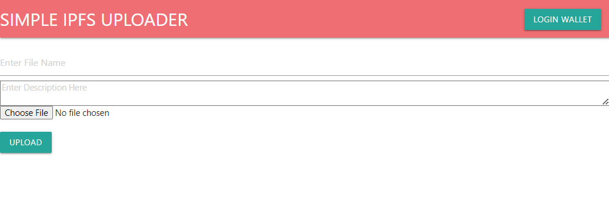

## Simple IPFS Uploader dApp

## Description

In this project, I was able to create a IPFS uploader dApp for the Ethereum mainnet. I didn't really focus on the UI of this project, but used Materialize to complete. Goal of the project was to learn how to use Moralis SDK to connect the metamask wallet of the user prior to uploading the file. Once the file is uploaded, the console will prompt the results of the ipfs image metadata as well as a special note. To use the dApp, please be sure the API key and Server URL is within the main.js file for all to work. For privacy purposes, the API and server info wasn't uploaded to repo. Grab yours at Moralis.io. (FREE)

Live Page: https://designiso.github.io/Simple-IPFS-dApp/ (Desktop Only)

## Getting Started

### Dependencies

* Materialize.min.js (CDN)
* Materialize.min.css (CDN)
* Moralis.io admin API KEY and SERVER URL

## Authors

Contributors names and contact info

Orion F.
(DesignIsOrion aka (BlockchainO)
